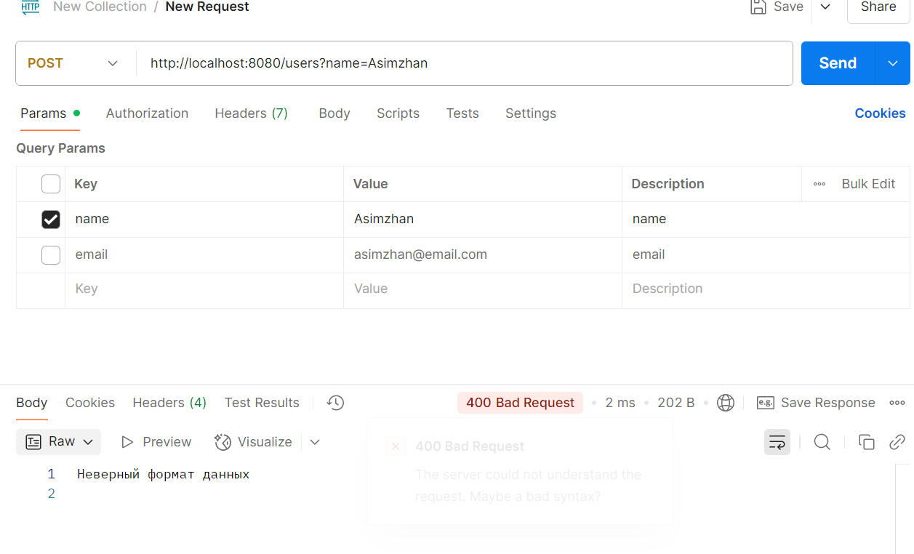
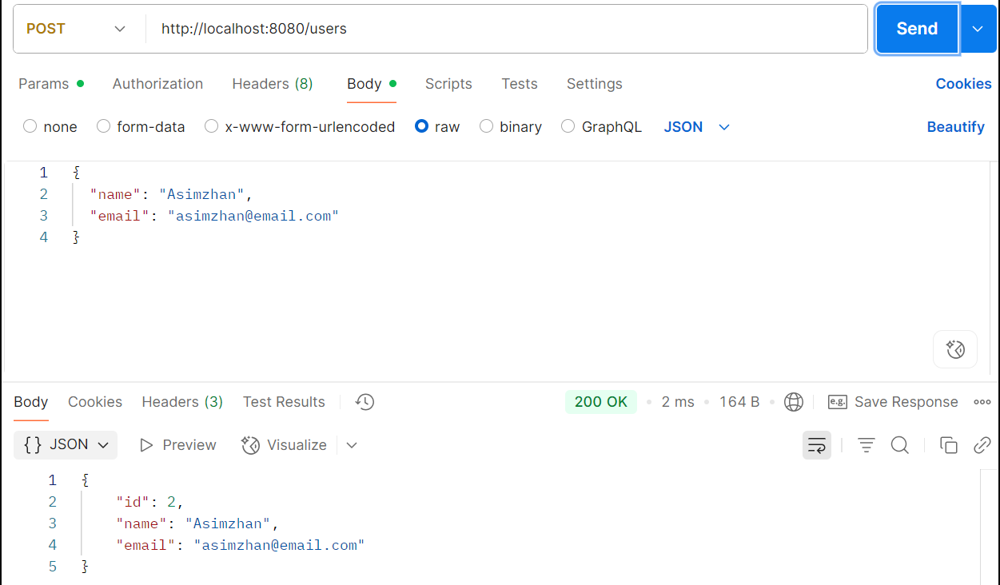

Отлично! Тогда я становлюсь твоим ментором по Go и финтех-проекту 💼👨‍🏫
Мы пойдём пошагово: от идеи до работающего backend-сервиса. Всё, что нужно — я тебе дам по ходу, в том числе и теорию, и примеры, и подсказки, если застрянешь.

---

## 🔧 Проект: "Финансовый кошелёк"

Минимальный функционал (MVP):

1. Регистрация и логин пользователя.
2. Создание счёта (в одной или нескольких валютах).
3. Пополнение и списание со счёта.
4. Переводы между счетами одного пользователя.
5. История операций.

Со временем добавим:

* Авторизацию с JWT.
* Админ-панель (например, просмотр всех пользователей).
* Курсы валют (с внешнего API).
* gRPC / GraphQL (по желанию).
* Docker, PostgreSQL, CI и так далее — как в реальном бою.

---

## 🔹 Задание №1 — подготовка проекта

### Цель:

Создать основу Go-проекта с REST API.

---

### 📌 Что нужно сделать:

1. Установить Go (если ещё не установлен).
2. Создать новую папку проекта и инициализировать модуль:

   ```bash
   mkdir fintech-wallet
   cd fintech-wallet
   go mod init github.com/yourusername/fintech-wallet
   ```
3. Создай простой HTTP-сервер на Go, который отвечает на `/ping` текстом `"pong"`.
   Это будет твой "сердцебиение" сервера — признак, что он работает.

---

### 📘 Подсказка: Минимальный сервер

```go
package main

import (
    "fmt"
    "net/http"
)

func main() {
    http.HandleFunc("/ping", func(w http.ResponseWriter, r *http.Request) {
        fmt.Fprintln(w, "pong")
    })

    fmt.Println("Сервер запущен на http://localhost:8080")
    http.ListenAndServe(":8080", nil)
}
```

---

### ✅ Критерии готовности:

* У тебя есть рабочий Go-проект.
* Ты запускаешь `go run main.go` и заходишь на [http://localhost:8080/ping](http://localhost:8080/ping) — получаешь `pong`.
* Готов двигаться дальше.

---

Отлично. Давай я дам тебе **базу Go** — ровно то, что тебе нужно **для старта проекта с HTTP-сервером**. Всё будет **пошагово, просто и с комментариями**, как ты просил.

---

## 🧱 1. Структура простейшей Go-программы

```go
package main  // точка входа, обязательный пакет для запуска программы

import (
    "fmt"       // стандартный пакет для вывода текста
    "net/http"  // пакет для работы с HTTP (сервер, запросы, ответы)
)

func main() {  // функция main — запуск приложения

    // Регистрируем обработчик (handler) на путь "/ping"
    http.HandleFunc("/ping", func(w http.ResponseWriter, r *http.Request) {
        // Записываем в ответ строку "pong"
        fmt.Fprintln(w, "pong")
    })

    // Печатаем в консоль, что сервер запущен
    fmt.Println("Сервер запущен на http://localhost:8080")

    // Запускаем сервер на порту 8080
    http.ListenAndServe(":8080", nil)
}
```

---

## 🧠 Объяснение ключевых частей:

### 🔹 `package main`

Это обязательный пакет для любой программы, которую ты хочешь **запустить** напрямую.
Все остальные пакеты ты будешь либо подключать, либо писать сам (например, `package wallet` и т.д.).

---

### 🔹 `import (...)`

Ты подключаешь другие пакеты.
Вот как раз тут и лежит сила Go — у тебя будут **простые, читаемые библиотеки**:

* `fmt` — печать в консоль.
* `net/http` — работа с вебом.
* и многое другое: `os`, `io`, `strings`, `time`, `encoding/json` и т.д.

---

### 🔹 `http.HandleFunc("/ping", handler)`

Ты регистрируешь **обработчик HTTP-запросов**.
В нашем случае — если пользователь заходит на `/ping`, вызывается эта анонимная функция.

```go
func(w http.ResponseWriter, r *http.Request)
```

* `w` — это **ответ**, через него ты пишешь клиенту (например, браузеру).
* `r` — это **запрос**, из него можно получить метод, путь, параметры и тело запроса.

---

### 🔹 `fmt.Fprintln(w, "pong")`

Эта строка отправляет `"pong"` в ответ.

---

### 🔹 `http.ListenAndServe(":8080", nil)`

Запускает сервер, слушающий порт `8080`.
Параметр `nil` говорит, что мы используем стандартный роутер (тот, в который мы добавляли `HandleFunc`).

---

## ✍️ Бонус: Как запускать Go-программу

1. Сохрани файл как `main.go`.
2. Выполни в терминале:

   ```bash
   go run main.go
   ```
3. Перейди в браузере на `http://localhost:8080/ping` — ты увидишь `pong`.

---

Отлично, ты правильно подходишь: **сначала понять, потом писать код**.
Вот тебе **подробная база** по **всему новому**, что я добавил в Задании №2.
Будет много пояснений и комментариев — всё, как ты просил.

---

## 📦 1. `struct` — структура данных

```go
type User struct {
    ID    int    `json:"id"`
    Name  string `json:"name"`
    Email string `json:"email"`
}
```

### 📌 Что это такое:

* `type User struct { ... }` — объявление **нового типа данных**.
* Go не использует классы (как в ООП), вместо этого используются **структуры (`struct`)**.
* `User` теперь тип, которым ты можешь пользоваться: создавать переменные, передавать в функции и т.д.

### 📌 Теги `json:"..."`:

* Это **JSON-теги** — они указывают, как поля структуры будут **сериализоваться (преобразовываться) в JSON**.
* Без них `Name` стал бы `"Name"` в JSON (а не `name`), что неудобно.
* `json:"id"` значит: когда ты преобразуешь `User` в JSON, поле будет называться `id`.

---

## 🧱 2. Хранение пользователей в памяти

```go
var users []User  // срез (slice) пользователей
var idCounter int // счётчик ID
```

### 📌 `var users []User`

* Это **срез** (в Go это динамический массив).
* Тут будут храниться все зарегистрированные пользователи.

### 📌 `var idCounter int`

* Это просто число, которое увеличивается с каждым новым пользователем — имитирует `auto-increment id`, как в базе.

---

## 🧰 3. Обработка POST-запроса

Вот полная структура с пояснениями:

```go
func createUserHandler(w http.ResponseWriter, r *http.Request) {
```

### 📌 Это функция-обработчик HTTP-запроса:

* `w http.ResponseWriter` — интерфейс, через который ты **отправляешь ответ клиенту**.
* `r *http.Request` — структура, содержащая **информацию о запросе** (метод, тело, заголовки, путь и т.д.)

---

### Проверка метода запроса:

```go
    if r.Method != http.MethodPost {
        http.Error(w, "Метод не поддерживается", http.StatusMethodNotAllowed)
        return
    }
```

📌 Здесь мы проверяем, что это именно `POST`-запрос (а не GET, PUT и т.д.).
Если нет — возвращаем ошибку 405.

---

### Декодирование JSON:

```go
    var newUser User
    err := json.NewDecoder(r.Body).Decode(&newUser)
```

📌 `r.Body` — это тело запроса (в нём лежит JSON).
📌 `json.NewDecoder().Decode(&newUser)` — распарсит JSON и запишет данные в структуру `newUser`.

* Если JSON кривой — будет ошибка `err`.
* `&newUser` — передаём **указатель** (Go работает с памятью напрямую, но безопасно).

---

### Проверка данных:

```go
    if newUser.Name == "" || newUser.Email == "" {
        http.Error(w, "Имя и email обязательны", http.StatusBadRequest)
        return
    }
```

📌 Тут ты просто проверяешь, что имя и email пришли.

---

### Установка ID и добавление в "базу":

```go
    idCounter++
    newUser.ID = idCounter
    users = append(users, newUser)
```

📌 Увеличиваем ID счётчик и сохраняем нового пользователя в срез `users`.

---

### Возврат ответа:

```go
    w.Header().Set("Content-Type", "application/json")
    json.NewEncoder(w).Encode(newUser)
```

📌 Говорим клиенту, что отправляем JSON (`Content-Type`).
📌 Кодируем `newUser` обратно в JSON и отправляем клиенту.

---

## 🧪 Как это работает при запросе

1. Ты отправляешь `POST /users` с телом:

```json
{
  "name": "Асымжан",
  "email": "asim@example.com"
}
```

2. Go читает JSON, создаёт `User`, присваивает `ID`, сохраняет в `users`.

3. Отправляет обратно такой ответ:

```json
{
  "id": 1,
  "name": "Асымжан",
  "email": "asim@example.com"
}
```

---

## 🔁 Пример: как всё выглядит в одном месте

Вот минимальный пример целиком:

```go
package main

import (
    "encoding/json"
    "fmt"
    "net/http"
)

type User struct {
    ID    int    `json:"id"`
    Name  string `json:"name"`
    Email string `json:"email"`
}

var users []User
var idCounter int

func createUserHandler(w http.ResponseWriter, r *http.Request) {
    if r.Method != http.MethodPost {
        http.Error(w, "Метод не поддерживается", http.StatusMethodNotAllowed)
        return
    }

    var newUser User
    err := json.NewDecoder(r.Body).Decode(&newUser)
    if err != nil {
        http.Error(w, "Ошибка разбора JSON", http.StatusBadRequest)
        return
    }

    if newUser.Name == "" || newUser.Email == "" {
        http.Error(w, "Имя и email обязательны", http.StatusBadRequest)
        return
    }

    idCounter++
    newUser.ID = idCounter
    users = append(users, newUser)

    w.Header().Set("Content-Type", "application/json")
    json.NewEncoder(w).Encode(newUser)
}

func main() {
    http.HandleFunc("/users", createUserHandler)

    fmt.Println("Сервер запущен на http://localhost:8080")
    http.ListenAndServe(":8080", nil)
}
```

---

Супер! Тогда продолжим — медленно, глубоко и осмысленно 👣

---

## 🔧 Задание №3 — `GET /users`: список всех пользователей

### 🎯 Цель:

* Научиться обрабатывать `GET`-запросы.
* Отдавать JSON-ответ клиенту.
* Увидеть, как выглядит **сериализация среза структур**.

---

### 💬 Сценарий:

Ты отправляешь `GET /users` — а сервер возвращает список всех пользователей в JSON.

Пример ответа:

```json
[
  {
    "id": 1,
    "name": "Асымжан",
    "email": "asim@example.com"
  },
  {
    "id": 2,
    "name": "Асем",
    "email": "asem@example.com"
  }
]
```

---

## 🧱 Обработчик `GET /users`

```go
func getUsersHandler(w http.ResponseWriter, r *http.Request) {
    if r.Method != http.MethodGet {
        http.Error(w, "Метод не поддерживается", http.StatusMethodNotAllowed)
        return
    }

    w.Header().Set("Content-Type", "application/json")
    json.NewEncoder(w).Encode(users)
}
```

### 📘 Объяснение:

* `if r.Method != http.MethodGet`: проверка, что это `GET`.
* `w.Header().Set(...)`: указываем, что мы возвращаем JSON.
* `json.NewEncoder(w).Encode(users)`: сериализуем срез `users` в JSON и пишем его в ответ.

---

## 🔗 Подключи обработчик

Добавь в `main()`:

```go
http.HandleFunc("/users", usersHandler)
```

И сам `usersHandler` будет распределять `GET` и `POST`:

```go
func usersHandler(w http.ResponseWriter, r *http.Request) {
    switch r.Method {
    case http.MethodGet:
        getUsersHandler(w, r)
    case http.MethodPost:
        createUserHandler(w, r)
    default:
        http.Error(w, "Метод не поддерживается", http.StatusMethodNotAllowed)
    }
}
```

---

## 🧪 Как протестировать

Открой в терминале:

```bash
curl http://localhost:8080/users
```

Или в Postman — метод `GET`, адрес `http://localhost:8080/users`.

---

## 🧠 Мини-упражнение (если хочешь закрепить)

Попробуй сам:

* добавить `GET /ping` и возвращать:

  ```json
  {
    "status": "ok",
    "time": "2025-07-09T12:34:56Z"
  }
  ```

Это будет хорошим закреплением: структуры, сериализации, текущего времени (`time.Now()`).

---


Спасибо за скриншот! Всё понятно: ты отправляешь `POST`-запрос на `/users`, но передаёшь данные **через параметры запроса (Query Params)**, а не в **теле запроса в формате JSON**, как ожидает твой Go-сервер.

Вот почему ты получаешь:

```
400 Bad Request
Неверный формат данных
```

---

## 💥 Что не так?

### ❌ Сейчас:

* Ты отправляешь `POST` на `http://localhost:8080/users?name=Asimzhan&email=...`
* Но сервер **ожидает тело запроса в формате JSON**, а не query-параметры.

---

## ✅ Как правильно?

1. Выбери в Postman вкладку **Body**
2. Поставь галочку **raw**
3. Выбери формат **JSON**
4. Вставь это в тело запроса:

```json
{
  "name": "Asimzhan",
  "email": "asimzhan@email.com"
}
```

5. Заголовок `Content-Type` должен быть:

```
application/json
```

Postman обычно добавляет его автоматически, но можно вручную во вкладке **Headers**.

---

## 🔁 Почему так?

Твой код использует:

```go
json.NewDecoder(r.Body).Decode(&newUser)
```

А значит, **он ожидает JSON из тела запроса**, а не из query-параметров (`r.URL.Query()`).

---


